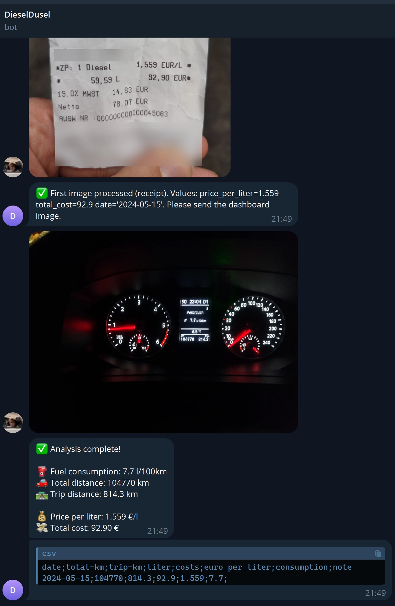

# DieselDusel Bot

A Telegram bot that helps you track your car's fuel consumption and costs by analyzing photos of your car's dashboard and fuel receipts.



## Features

- 📸 Analyzes photos of car dashboards and fuel receipts
- ⛽ Extracts fuel consumption data (l/100km)
- 🚗 Tracks total and trip distances
- 💰 Records fuel prices and total costs
- 📊 Generates CSV data for easy tracking
- 🤖 User-friendly Telegram interface

## Prerequisites

- Python 3.12 or higher
- Telegram Bot Token (get it from [@BotFather](https://t.me/botfather))
- OpenRouter API Key (get it from [OpenRouter](https://openrouter.ai/))

## Installation

1. Clone the repository:

```bash
git clone https://github.com/LoggeL/DieselDusel
cd DieselDusel
```

2. Create and activate a virtual environment:

```bash
python -m venv venv
# On Windows:
.\venv\Scripts\activate
# On Unix or MacOS:
source venv/bin/activate
```

3. Install dependencies:

```bash
pip install -r requirements.txt
```

4. Create a `.env` file in the project root with your API keys:

```env
TELEGRAM_TOKEN=your_telegram_bot_token
OPENROUTER_API_KEY=your_openrouter_api_key
```

## Usage

1. Start the bot:

```bash
python main.py
```

2. Open Telegram and start a chat with your bot
3. Send `/start` to get started
4. Send a photo of your car's dashboard or fuel receipt
5. The bot will analyze the image and extract the relevant information
6. Send both dashboard and receipt photos to get a complete analysis

## Supported Image Types

### Dashboard Image

Should clearly show:

- Fuel consumption (Verbrauch) in l/100km
- Total kilometers
- Trip kilometers

### Receipt Image

Should clearly show:

- Price per liter
- Total cost
- Date of purchase

## CSV Output Format

The bot generates CSV data in the following format:

```csv
date;total-km;trip-km;liter;costs;euro_per_liter;consumption;note
```

## Development

The project uses:

- Python 3.12+
- python-telegram-bot for Telegram integration
- OpenRouter API for image analysis
- Pydantic for data validation
- Pillow for image processing

## Contributing

1. Fork the repository
2. Create a feature branch
3. Commit your changes
4. Push to the branch
5. Create a Pull Request

## License

This project is licensed under the MIT License - see the LICENSE file for details.

## Acknowledgments

- [OpenRouter](https://openrouter.ai/) for providing the AI API
- [python-telegram-bot](https://github.com/python-telegram-bot/python-telegram-bot) for the Telegram bot framework
